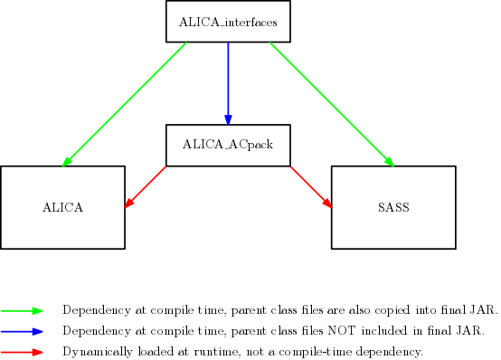

# ALICA Interfaces

This package contains the interface definitions for the primary
components of [ALICA](https://github.com/LEB-EPFL/ALICA), the
automatic illumination control package for light microscopy. It is a
compile-time dependency of ALICA.

## Relationship with ALICA and SASS

These interfaces are maintained separately of ALICA and
[SASS](https://github.com/LEB-EPFL/SASS) because they are not expected
to change frequently and should be quite stable.
