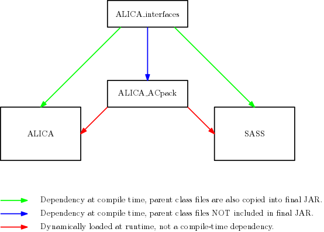

.. ALICA_interfaces documentation master file, created by
   sphinx-quickstart on Fri Apr 27 07:52:28 2018.
   You can adapt this file completely to your liking, but it should at least
   contain the root `toctree` directive.

ALICA Interfaces
================

Interfaces to the primary components of ALICA. 

.. toctree::
   :maxdepth: 1
   :caption: Contents:

   _javasphinx/packages

This package contains the interface definitions for the primary
components of ALICA, the automatic illumination control package for
light microscopy. It is a compile-time dependency of ALICA. These
interfaces are maintained separately of ALICA and SASS because they
are not expected to change frequently and should be quite stable.

Relationship with ALICA and SASS
--------------------------------

Acknowledgements
================

Authors
-------

- `Marcel Štefko <https://github.com/MStefko>`_
- `Kyle M. Douglass <https://kmdouglass.github.io>`_

See Also
========

- `ALICA`_ - Automated Laser Illumination Control Algorithm
- `SASS`_ - SMLM Acquistion Simulation Software

Indices and tables
==================

* :ref:`genindex`

.. _ALICA: https://github.com/LEB-EPFL/ALICA
.. _SASS: https://github.com/LEB-EPFL/SASS
